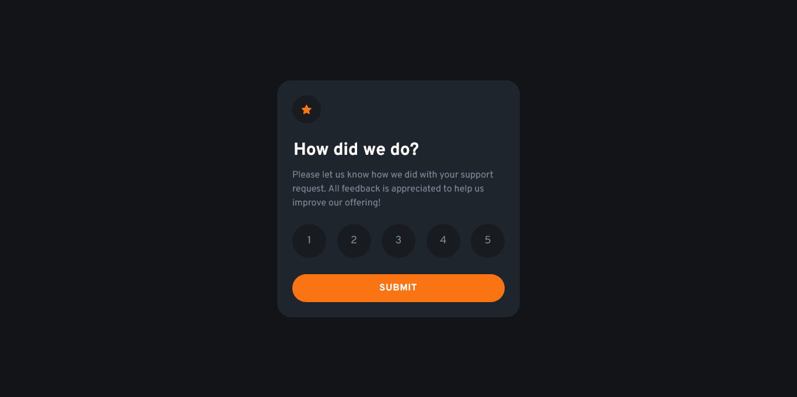

# Frontend Mentor - Interactive rating component solution

This is a solution to the [Interactive rating component challenge on Frontend Mentor](https://www.frontendmentor.io/challenges/interactive-rating-component-koxpeBUmI). Frontend Mentor challenges help you improve your coding skills by building realistic projects. 

## Table of contents

- [Overview](#overview)
  - [The challenge](#the-challenge)
  - [Screenshot](#screenshot)
  - [Links](#links)
- [My process](#my-process)
  - [Built with](#built-with)
  - [What I learned](#what-i-learned)
  - [Continued development](#continued-development)
  - [Useful resources](#useful-resources)
- [Author](#author)

## Overview

### The challenge

Users should be able to:

- View the optimal layout for the app depending on their device's screen size
- See hover states for all interactive elements on the page
- Select and submit a number rating
- See the "Thank you" card state after submitting a rating

### Screenshot



### Links

- Live Site URL: [Interactive Rating Component](https://arey-dev.github.io/interactive-rating-component/)

## My process

### Built with

- Semantic HTML5 markup
- CSS custom properties
- Flexbox
- Vanilla JavaScript


### What I learned

I did my best to apply my current knowledge regarding Javascript.

I've been learning JavaScript recently, and this was the first real world challenge that I did. While doing project, I've stumbled upon one of the important concepts in Javascript called *state*. Although applying the concept of *state* to do this challenge was more elegant, I didn't, and it's simply because I couldn't. My knowledge was limited, and it would take a lot of time finish this project If I were to study all the prerequisite knowledge required. 

This chunks of code allowed me to select and deselect a radio-button properly.
I was able to apply my knowledge about bubbling and delegation, which I just learned recently.
```js
const radioDiv = document.querySelector('.radio-button-container');
radioDiv.addEventListener('click', function(event) {
  event.preventDefault();
  if (event.target.className == 'radio-button-container' || event.target.tagName == 'LABEL') return;

  // get div wrapper
  const wrapper = event.target;
  
  // get radio input
  const radio = wrapper.previousElementSibling;

  handleChecked(wrapper, radio);
});

const wrappers = document.querySelectorAll('.value-wrapper');
function handleChecked(wrapper, radio) {

  // condition to undo selection
  if(radio.checked) {
    wrapper.classList.remove('checked');
    radio.checked = false;
    return; // return immediately after deselecting 
  }

  // clear styles for all value-wrappers first
  for(let wrapper of wrappers) {
    wrapper.classList.remove('checked');
  }

  if(!radio.checked) {
    wrapper.classList.add('checked');
    radio.checked = true;
  }
}
```

### Continued development

From now on, I'm just gonna continue on taking JavaScript projects from Frontend Mentor where I can apply my knowledge.

### Useful resources

- [javascipt.info](https://javascript.info/) - This is where I learn JavaScript
- [MDN Web Docs](https://developer.mozilla.org/en-US/) - This is my go-to website for a references.

## Author

- Frontend Mentor - [@arey-dev](https://www.frontendmentor.io/profile/arey-dev);